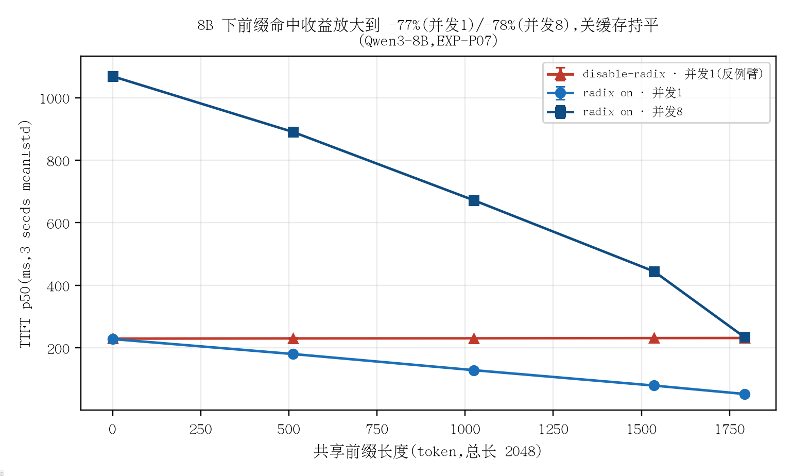
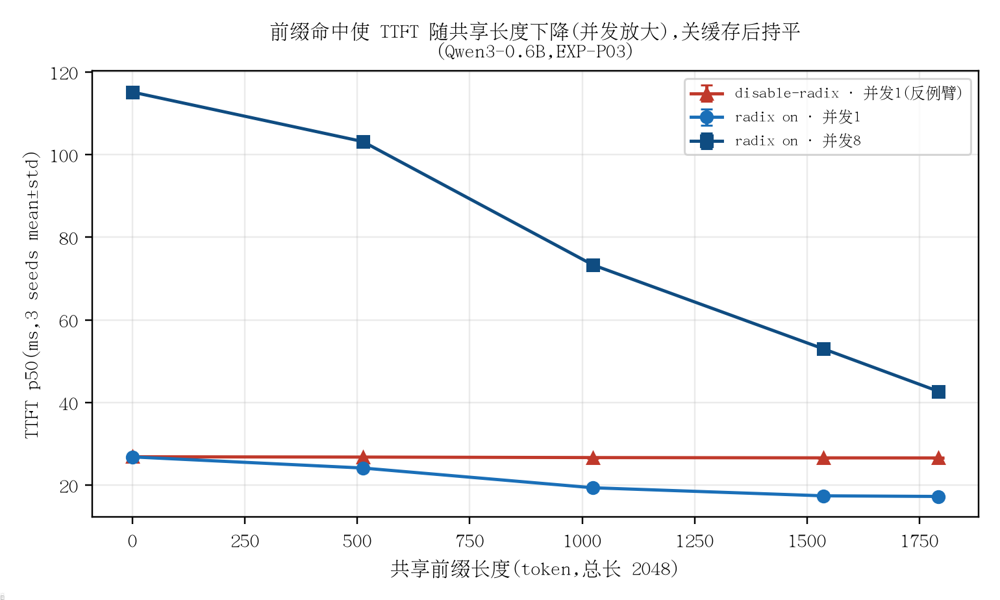
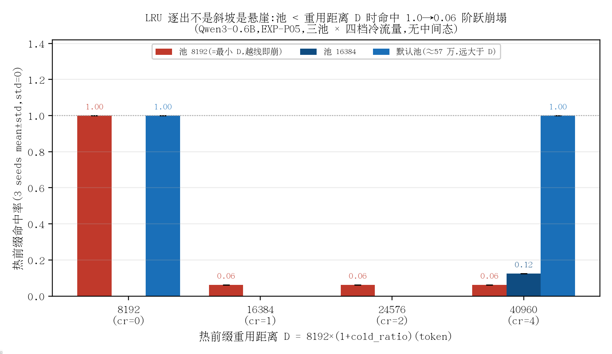
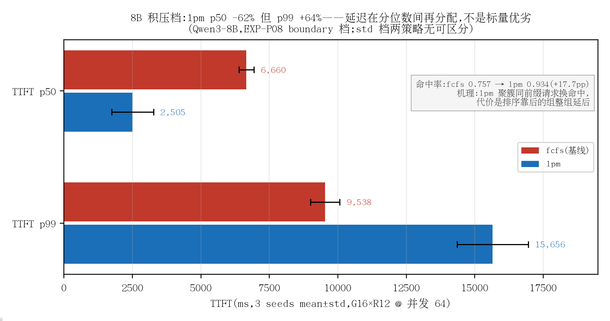

# SGLang Prefix Lab · RadixAttention 机理与收益边界

本项目在 2×RTX 4090 上对 SGLang v0.5.18 的**前缀缓存(RadixAttention)**做源码级机理分析与可复现测量,
回答一个 serving 里常被想当然的问题:**前缀缓存的收益从哪里来、有多大、在什么边界失效。**

LLM 服务的真实流量里,大量请求共享系统提示词、few-shot 模板等公共前缀;RadixAttention 把已算出的 KV
按 token 序列组织成 radix tree,新请求做最长前缀匹配后直接复用 KV、跳过对应 prefill。但"开了缓存就更快"
在什么条件下成立、失效模式长什么样,公开资料少有定量回答——本项目用预注册假设、反例臂与引擎计数器闭环,
把它做成一组可复现、可证伪的测量。

## 🎯 核心结果

| 结果 | 数字(测量条件内联) | 证据指针 |
|---|---|---|
| 前缀命中收益(Qwen3-8B) | TTFT p50 228.4→52.9 ms(并发1,**−77%**)、1068.3→234.5 ms(并发8,**−78%**)@ 共享前缀 1792/2048,3 轮 mean±std;disable-radix 反例臂全线打平 | EXP-P07 · [data/derived/exp_p07_8b_ttft_vs_prefix.csv](data/derived/exp_p07_8b_ttft_vs_prefix.csv) |
| 逐 token 归因闭环 | 引擎计数器 device_hit = **466,944** 与客户端 Σcached_tokens 逐 token 相等(0.6B/8B 双复现) | EXP-P03/P07 §6 |
| LRU 逐出悬崖 | 池 < 重用距离 8192×(1+cr) 时命中 **1.0→0.0625 阶跃崩塌**,无中间态;三池×四档冷流量,3 轮 seed 间 std=0 | EXP-P05 · [data/derived/exp_p05_eviction_cliff.csv](data/derived/exp_p05_eviction_cliff.csv) |
| 调度不是标量优劣(8B 积压档) | lpm p50 **−62%**、命中 **+17.7pp**,但 p99 **+64%**(3 轮 mean±std)——延迟在分位数间再分配;0.6B 同协议(EXP-P04)则单纯反劣 | EXP-P08 · [data/derived/exp_p08_8b_fcfs_vs_lpm.csv](data/derived/exp_p08_8b_fcfs_vs_lpm.csv) |
| radix 命中首证 | 第二发 cached=**1324/1325(=n−1)**,精确命中源码"至少重算 1 token"的上限(单轮确定性验证) | EXP-P01 · data/raw/EXP-P01/ |
| 预注册证伪 ×3(全程留痕) | Qwen3 thinking 开关=纯尾扩展不破坏共享(P02);rr 全命中=奇偶分片巧合、cache-aware 冷启动把热前缀全钉一卡(流量 100/0)而崩(P06 双证伪) | EXP-P02 / EXP-P06 |

## 📊 图表(全部由 scripts/ 从 data/ 生成)



**8B 下前缀命中收益放大到 −77%/−78%,disable-radix 反例臂持平——收益确来自前缀复用,不是别的。**
src: [data/derived/exp_p07_8b_ttft_vs_prefix.csv](data/derived/exp_p07_8b_ttft_vs_prefix.csv)(EXP-P07,3 轮 mean±std)· [scripts/plot_ttft_curve.py](scripts/plot_ttft_curve.py)



**同协议 0.6B 只有 −36%/−63%:prefill 占比越小收益天花板越低——"命中收益正比于被跳过的 prefill"的直接量化。**
src: [data/derived/exp_p03_ttft_vs_prefix.csv](data/derived/exp_p03_ttft_vs_prefix.csv)(EXP-P03,3 轮 mean±std)· [scripts/plot_ttft_curve.py](scripts/plot_ttft_curve.py)



**LRU 逐出不是斜坡是悬崖:池 ≥ 重用距离 D=8192×(1+cr) 则命中 1.0,越线即崩至 ~0.06,三池验证无一例外(std=0)——容量规划要按重用距离而不是热集大小。**
src: [data/derived/exp_p05_eviction_cliff.csv](data/derived/exp_p05_eviction_cliff.csv)(EXP-P05,3 轮 mean±std)· [scripts/plot_eviction_cliff.py](scripts/plot_eviction_cliff.py)



**8B 积压档 lpm 把延迟从中位数搬到尾部换命中率(p50 −62%/hit +17.7pp/p99 +64%)——选 lpm 与否取决于 SLO 定义在 p50 还是 p99。**
src: [data/derived/exp_p08_8b_fcfs_vs_lpm.csv](data/derived/exp_p08_8b_fcfs_vs_lpm.csv)(EXP-P08,3 轮 mean±std)· [scripts/plot_sched_tradeoff.py](scripts/plot_sched_tradeoff.py)

## 🧠 关键发现:为什么是这样

**1. 命中收益正比于被跳过的 prefill,并发把它放大。** 同一协议下 8B 的 TTFT p50 降 77%/78%,
0.6B 只降 36%/63%:模型越大,prefill 在 TTFT 中占比越高,可被跳过的部分越多,收益天花板越高。
并发从 1 到 8,0.6B 每命中 token 的 TTFT 斜率从 5.3µs 升到 40µs——跳过的 prefill 同时缩短了
排队队列,缓存收益里有一部分是"别的请求不用再排我的队"。

**2. 命中上限是 input_len−1,不是 input_len。** 调度器把前缀匹配上限压到输入长度减一:
必须至少重算 1 个 token,否则没有 logits 可采样。实测同一请求第二发 cached=1324/1325,
恰为 n−1 的精确值——机制从源码读出([docs/theory/01_radix_prefix_cache.md](docs/theory/01_radix_prefix_cache.md)),再被测量钉死。

**3. LRU 逐出不是斜坡,是悬崖。** 热前缀命中率只有 1.0 和 ~0.06 两个稳态:池容量 ≥ 重用距离
D=8192×(1+cold_ratio) 则全命中,越线即崩,三种池容量 × 四档冷流量无一中间态。工程含义:
容量规划要按**重用距离**而不是热集大小——冷流量插队会线性推远热前缀的重用距离,
把"看上去够用"的池瞬间推过悬崖。

**4. 调度与路由的"更好"都必须带定语。** 8B 积压档下 lpm 调度 p50 −62%、命中 +17.7pp,
但 p99 +64%:它把延迟从中位数搬到尾部换命中,选不选取决于 SLO 定义在 p50 还是 p99;
0.6B 同协议则单纯反劣。路由侧两条预注册预测双双被证伪:round-robin 的"全命中"是热集大小
与副本数的奇偶巧合(奇数热集对照组即崩),cache-aware 路由冷启动会把热前缀全部钉在一张卡上
(流量计数 100/0)——**缓存亲和不等于扩容**。

## 🔬 代码导览:TTFT 怎么停表,命中怎么闭环

节选自 [scripts/bench_prefix.py](scripts/bench_prefix.py)(`# ←` 为导读注释)。同一次流式请求里**既停表又拿到
server 侧命中数**,"快了多少"与"命中了多少"在同一响应内闭合,归因不靠猜:

```python
async def one_request(session, url, model, ids, out_tokens):
    payload = {"model": model, "input_ids": ids,        # ← token id 直传,绕过 chat template 渲染差异
               "messages": [{"role": "user", "content": "x"}],
               "temperature": 0.0, "max_tokens": out_tokens, "stream": True,
               "stream_options": {"include_usage": True}}  # ← 让 server 把 usage 随流返回
    t0 = time.perf_counter()
    ttft = None; cached = None
    async with session.post(url + "/v1/chat/completions", json=payload) as r:
        async for raw in r.content:
            ...
            ch = d.get("choices") or []
            if ttft is None and ch and (ch[0].get("delta") or {}).get("content"):
                ttft = (time.perf_counter() - t0) * 1e3  # ← 首个 content chunk 到达 = TTFT 停表
            u = d.get("usage")
            if u and u.get("prompt_tokens_details"):
                cached = u["prompt_tokens_details"].get("cached_tokens")  # ← server 报的命中 token 数
    return {"ttft_ms": ttft, "e2e_ms": e2e, "cached_tokens": cached}
```

机制一句话([docs/theory/01_radix_prefix_cache.md](docs/theory/01_radix_prefix_cache.md)):
服务端把每个请求的 **token id 序列**插进 radix tree(节点 value=KV 物理块索引),新请求最长前缀匹配后
直接复用 KV 跳过 prefill;调度侧把匹配上限压到 **input_len−1**——永远至少重算 1 个 token,否则没有
logits 可采样。实测锚:EXP-P01 第二发 cached=1324/1325,**正是 n−1 的精确值**,不是近似。

聚合侧的闭环校验在 [scripts/aggregate_p03.py](scripts/aggregate_p03.py):每个请求的 cached_tokens 必须
恰等于 prefix_len(ON 臂)或 0(OFF 臂),再与 /metrics 的 `device_hit` 计数器交叉对账。

## 🚀 复现 Quickstart

```bash
bash scripts/preflight.sh            # 两卡空闲 + 端口清白,否则中止
bash scripts/svc.sh start w0 0 28000 --model-path Qwen/Qwen3-0.6B \
  --revision c1899de289a04d12100db370d81485cdf75e47ca --tp 1 \
  --enable-metrics --enable-cache-report
bash scripts/svc.sh wait_health w0

# 命中收益曲线的一个 round(3 轮 = 换 --seed 重跑;raw 以时间前缀写新文件,不覆盖)
/root/venvs/sglang-lab/bin/python scripts/bench_prefix.py \
  --base-url http://127.0.0.1:28000 --concurrency 8 --seed 101 \
  > data/raw/EXP-P03/$(date -u +%Y%m%dT%H%M)_radix_on_c8.jsonl

python scripts/aggregate_p03.py EXP-P03 data/derived/exp_p03_ttft_vs_prefix.csv
python scripts/plot_ttft_curve.py data/derived/exp_p03_ttft_vs_prefix.csv \
  figures/fig1_p03_ttft_vs_prefix_0p6b.png "标题=结论句" "Qwen3-0.6B"
bash scripts/svc.sh stop w0
```

其余协议同构:P05 用 [scripts/bench_evict.py](scripts/bench_evict.py) + [scripts/aggregate_evict.py](scripts/aggregate_evict.py),
P04/P08 用 [scripts/bench_groups.py](scripts/bench_groups.py) + [scripts/aggregate_groups.py](scripts/aggregate_groups.py),
P06 用 [scripts/bench_route_pool.py](scripts/bench_route_pool.py)。异地环境见 [ENV.md](ENV.md)。

## 📚 实验记录索引

每个实验一份八节记录(预注册假设 → 协议 → 原始数据指针 → 结论/证伪),
原理笔记见 [docs/theory/](docs/theory/),预注册协议见 [docs/PLAN.md](docs/PLAN.md)。

| 记录 | 一句话结论 |
|---|---|
| [EXP-S00](records/EXP-S00_bootstrap_audit.md) | 环境与基线体检:双卡/端口清白证明,以及一次 60s 超时故障的排查定位 |
| [EXP-S01](records/EXP-S01_env_and_single_worker_smoke.md) | 实验环境(venv)安装验证与首个单 worker 冒烟——现行共用环境的出生证明 |
| [EXP-P01](records/EXP-P01_env_single_worker_smoke.md) | radix 命中首证:第二发 cached=1324/1325(=n−1),确定性通过,flashinfer 后端 |
| [EXP-P02](records/EXP-P02_token_contract_matrix.md) | 五格 token 契约矩阵:四格符合预注册;thinking 开关被证明是纯尾扩展,不破坏前缀共享(预注册假设证伪) |
| [EXP-P03](records/EXP-P03_hit_benefit_curve.md) | 0.6B 收益曲线:TTFT p50 并发1 −36%/并发8 −63%;device_hit 与 Σcached 逐 token 相等 |
| [EXP-P04](records/EXP-P04_lpm_vs_fcfs.md) | 0.6B 调度:轻载两策略判平;超 128 等待窗口后 lpm p99 反劣 13%、命中 −2.4pp |
| [EXP-P05](records/EXP-P05_eviction_pressure.md) | LRU 逐出悬崖:命中 ⇔ 池 ≥ 重用距离 8192×(1+cr),1.0→0.06 阶跃、无中间态 |
| [EXP-P06](records/EXP-P06_routing_pool_capacity.md) | 路由双证伪:rr 全命中系奇偶分片巧合;cache-aware 冷启动把热前缀全钉一卡(流量 100/0) |
| [EXP-P07](records/EXP-P07_8b_hit_benefit_curve.md) | 8B 收益曲线:TTFT p50 −77%/−78%,反例臂持平,计数器闭环在 8B 复现 |
| [EXP-P08](records/EXP-P08_8b_scheduling_tradeoff.md) | 8B 调度权衡:lpm p50 −62%/命中 +17.7pp/p99 +64%——分位数再分配,不是标量优劣 |

## 🧪 测量方法

本项目把测量的可信度做成流程,而不是态度:

- **可溯源**:进入本文的每个数字都能回溯到 data/raw/ 下的原始测量文件(随附环境、完整命令与硬件信息);
  表与图全部由 scripts/ 从 data/ 重算生成,不手改。
- **误差条**:关键结论一律 ≥3 独立轮(独立 seed),报 mean±std;个别一次性观察在记录中明确标注为单轮,
  不与多轮数字混排。
- **对照与反例**:每条收益主张配反例臂(如 disable-radix)与对照组(如路由实验的奇数热集对照),
  并与引擎侧计数器交叉对账(device_hit 与客户端 Σcached_tokens 逐 token 相等)——归因不靠猜。
- **预注册与负结果**:假设与判定阈值在运行前锁定([docs/PLAN.md](docs/PLAN.md));被实验推翻的假设照常
  报告并全程保留(P02/P05/P06)——负结果与正结果同权。

## 🧭 Future work

在同一预注册框架下扩展**双副本 router 性能矩阵**(吞吐/延迟 × 调度策略 × 缓存亲和;
协议已就绪:[docs/PLAN_router_matrix.md](docs/PLAN_router_matrix.md) +
[config/protocol-router-v1.json](config/protocol-router-v1.json)),
把本仓的单 worker 机理结论推进到 serving 部署形态下的端到端验证。

## 🔗 相关项目

- [github.com/lyell0710/vllmExperience](https://github.com/lyell0710/vllmExperience) — vLLM 侧部署形态/PD/MoE 证据仓
- [github.com/lyell0710/Kernel_Optimazation](https://github.com/lyell0710/Kernel_Optimazation) — CUDA kernel 优化证据仓
- [github.com/lyell0710/llm-engine](https://github.com/lyell0710/llm-engine) — 手写推理引擎
